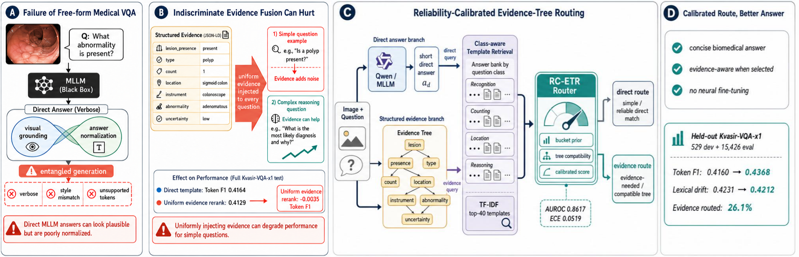
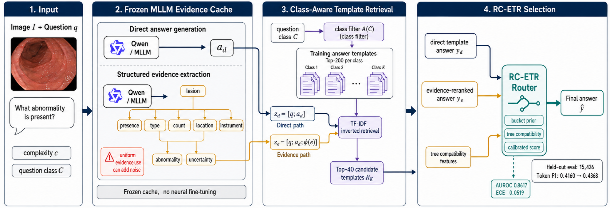
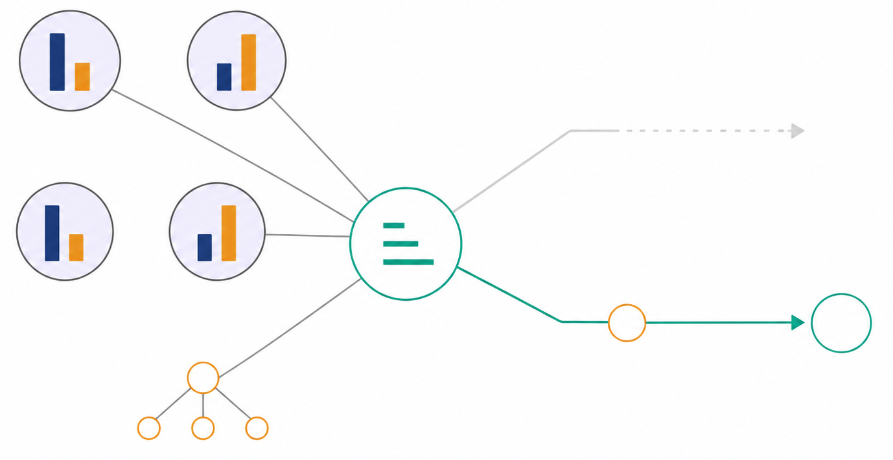
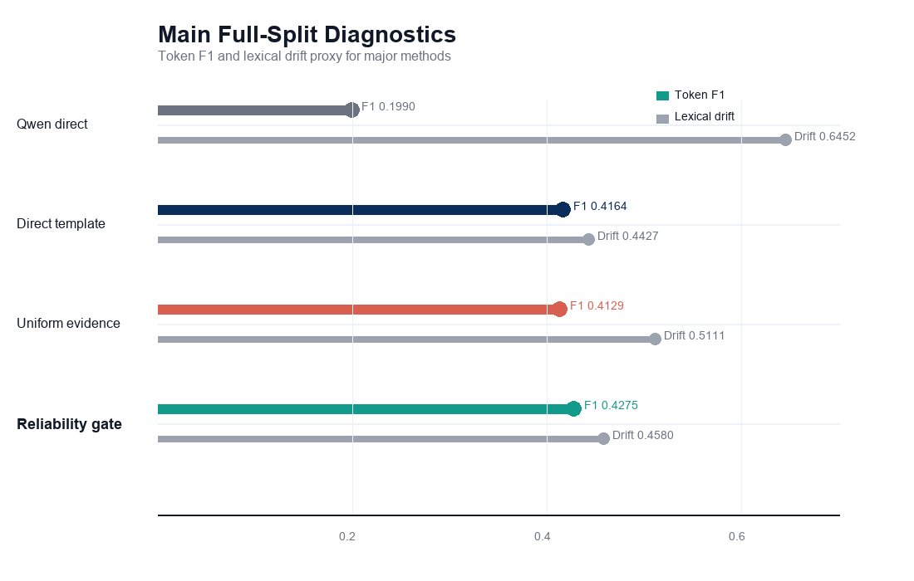

# MedHEval-Tree-V

<p align="center">
  <strong>Reliability-Calibrated Evidence-Tree Routing for Medical Visual Question Answering</strong>
</p>

<p align="center">
  中文名：MedHEval-Tree-V，面向医学视觉问答的可靠性校准证据树路由框架
</p>

<p align="center">
  <a href="#quick-start">Quick Start</a> ·
  <a href="#method-overview">Method Overview</a> ·
  <a href="#experiments">Experiments</a> ·
  <a href="#data-and-labels">Data and Labels</a> ·
  <a href="#reproduction">Reproduction</a>
</p>

<p align="center">
  
  
  
  
  
</p>

MedHEval-Tree-V is a research codebase for studying a practical failure mode in medical visual question answering: **structured evidence is not always beneficial**. A frozen multimodal LLM can produce useful visual evidence, but injecting that evidence into every question may degrade simple recognition cases. This repository implements a reliability-calibrated routing framework that decides when evidence should be trusted and when direct answer normalization is safer.



## Core Idea

Medical VQA systems often entangle two different problems:

- visual grounding: identifying what is visible in the medical image;
- answer normalization: matching the concise answer style expected by the benchmark.

Free-form MLLM answers may be visually plausible but verbose or poorly normalized. Structured evidence can help complex reasoning questions, but uniform evidence fusion can add noise to simple questions. MedHEval-Tree-V separates these concerns:

> Use the MLLM to produce direct answers and structured evidence, use class-aware retrieval to normalize candidate answers, and use a calibrated evidence-tree router to select the reliable route per sample.

## Highlights

- **No neural fine-tuning**: the visual-language model is frozen; all routing is performed over cached outputs.
- **Structured evidence cache**: direct answers and JSON-like evidence records are generated once and reused.
- **Class-aware answer normalization**: training answers are grouped by question class and retrieved with TF-IDF.
- **Evidence-tree compatibility**: candidate answers are checked against field-level evidence signals.
- **Reliability-calibrated routing**: a lightweight route estimator selects direct or evidence-aware answers per sample.
- **Robustness analyses**: random development splits, bootstrap significance, metadata ablation, shuffle controls, strong Qwen prompt baselines, and SLAKE stress testing are included.

## Method Overview

The pipeline has four stages:

1. **Input**: an endoscopic image, a question, a complexity label, and one or more question classes.
2. **Frozen MLLM Evidence Cache**: the MLLM generates a direct answer `a_d` and a structured evidence tree `e`.
3. **Class-Aware Template Retrieval**: a class filter restricts the answer bank, and TF-IDF retrieves top-K templates for both direct and evidence-conditioned queries.
4. **RC-ETR Selection**: direct-template and evidence-reranked candidates are routed through a reliability-calibrated evidence-tree router.



The routing mechanism is deliberately lightweight. It compares route reliability patterns from development data, evidence-tree compatibility, and sample-level route features, then sends only the selected route to the final answer.



## Experiments

The released code follows the real experiment sequence used in the paper:

| Stage | Purpose | Main scripts |
|---|---|---|
| Lightweight baselines | Majority, template, lexical retrieval sanity checks | `run_kvasir_vqa_lite_experiments.py` |
| MLLM cache | Qwen direct answer and structured evidence extraction | `run_qwen_sanity.py` |
| Template retrieval | Direct-template and evidence-aware reranking | `evaluate_full_tfidf_fast.py` |
| Bucket routing | Development-prefix reliability gate | `analyze_reliability_gates.py` |
| Robustness | Random splits, bootstrap, metadata ablation, shuffle controls | `cache_only_strengthening.py` |
| RC-ETR | Evidence-tree compatibility and calibrated sample-level routing | `reliability_calibrated_tree_v2.py` |
| Prompt baselines | Constrained, metadata-aware, and evidence-first Qwen prompts | `run_qwen_strong_baselines.py` |
| External stress test | SLAKE routing-principle validation | `slake_external_validation.py` |

### Released Aggregate Results

Only aggregate CSVs are included. Full per-sample prediction dumps are intentionally excluded because they may contain benchmark text, gold answers, image identifiers, and model outputs.

Key real-result files:

| File | Description |
|---|---|
| `qwen_full_tfidf_fast_metrics.csv` | Full-split diagnostic metrics for direct template and evidence reranking |
| `reliability_gate_metrics.csv` | Development-prefix bucket-gate evaluation |
| `rcetr_v2_main.csv` | Held-out RC-ETR main results and ablations |
| `rcetr_v2_random_summary.csv` | RC-ETR random development split summary |
| `cache_only_bootstrap.csv` | Paired bootstrap confidence interval |
| `cache_only_metadata_ablation.csv` | Metadata ablation for route policies |
| `cache_only_shuffle_summary.csv` | Evidence shuffle and control results |
| `cache_only_calibrated_gate_summary.csv` | Calibrated gate summary |
| `qwen_strong_baseline_metrics.csv` | Strong Qwen prompt baselines |
| `slake_external_summary_en.csv` | SLAKE English stress-test summary |

Representative held-out Kvasir-VQA-x1 results from `rcetr_v2_main.csv`:

| Method | Eval N | Token F1 | Lexical Drift | Evidence Route Rate |
|---|---:|---:|---:|---:|
| Direct template | 15,426 | 0.4160 | 0.4231 | 0.0% |
| Uniform evidence rerank | 15,426 | 0.4127 | 0.4809 | 100.0% |
| Bucket gate | 15,426 | 0.4268 | 0.4336 | 44.2% |
| RC-ETR without tree | 15,426 | 0.4321 | 0.4348 | -- |
| RC-ETR | 15,426 | 0.4368 | 0.4212 | 26.1% |

The important observation is not simply that evidence can improve performance. The negative control is equally important: **uniform evidence reranking is worse than direct template retrieval**, which motivates selective routing.



## Repository Structure

```text
.
├── README.md
├── LICENSE
├── requirements.txt
├── CITATION.cff
├── docs/
│   ├── data_schema.md
│   ├── open_source_scope.md
│   ├── reproduction.md
│   └── reports/
├── paper_figures/
│   ├── Figure1.png
│   ├── Figure2.png
│   ├── Figure3.png
│   ├── main_results.png
│   ├── tradeoff_scatter.png
│   ├── complexity_effect.png
│   └── complexity_routing_lines.png
├── examples/
│   ├── sample_qwen_cache.jsonl
│   └── sample_template_predictions.csv
├── step3_dataset_migration/raw/kvasir_vqa_x1/
│   └── README.md
├── data/slake/
│   └── README.md
└── step5_experiments/
    ├── scripts/
    ├── server_scripts/
    └── results/
```

## Quick Start

Create a Python environment:

```bash
python -m venv .venv
source .venv/bin/activate
pip install -r requirements.txt
```

For Qwen/MLLM inference, install a CUDA-compatible PyTorch build and set the model path:

```bash
export QWEN_MODEL_PATH=/path/to/Qwen3.5-9B
export CUDA_VISIBLE_DEVICES=0,1
```

Cache-only experiments can run on CPU once the Qwen output cache and template prediction CSV have been generated.

## Data and Labels

### Kvasir-VQA-x1

Place dataset parquet files here:

```text
step3_dataset_migration/raw/kvasir_vqa_x1/
├── train.parquet
└── test.parquet
```

Expected columns:

| Column | Meaning |
|---|---|
| `img_id` | Image identifier |
| `question` | Natural-language VQA question |
| `answer` | Ground-truth benchmark answer |
| `complexity` | Dataset-provided complexity label |
| `question_class` | One or more semantic question classes |

### Label Usage

`complexity` is used for development buckets, complexity-level analysis, and route features.

`question_class` is used in two places:

- the first class is treated as the primary class for bucket policies;
- all classes can activate class-specific answer-template banks.

The class-restricted candidate set is denoted conceptually as:

```text
A(C): answer templates whose training question class matches C
```

If no class-specific templates are available, the retrieval module falls back to a global high-frequency answer list.

### Structured Evidence Fields

The evidence branch expects a compact JSON-like record:

```json
{
  "lesion_presence": "yes",
  "lesion_type": "polyp",
  "lesion_count": "1",
  "location": "sigmoid colon",
  "instrument_presence": "no",
  "text_overlay_presence": "no",
  "abnormality_presence": "yes",
  "uncertainty": "low",
  "evidence_sentence": "A polyp-like lesion is visible."
}
```

The evidence-tree compatibility module maps these fields into interpretable compatibility signals between each candidate answer and the evidence record.

## Reproduction

### 1. Lightweight Kvasir Baselines

```bash
python step5_experiments/scripts/run_kvasir_vqa_lite_experiments.py
```

### 2. Build a Qwen Server Bundle

```bash
python step5_experiments/scripts/build_server_sanity_bundle.py
python step5_experiments/scripts/build_full_server_bundle.py
```

If the bundle uses image URLs:

```bash
python step5_experiments/server_scripts/download_kvasir_images.py \
  --bundle step5_experiments/server_bundle_full
```

### 3. Generate the Qwen Evidence Cache

Sanity run:

```bash
python step5_experiments/server_scripts/qwen_image_smoke.py
python step5_experiments/server_scripts/run_qwen_sanity.py \
  --bundle step5_experiments/server_bundle \
  --limit 20 \
  --out step5_experiments/results/qwen_sanity_outputs.jsonl
```

Full run:

```bash
python step5_experiments/server_scripts/run_qwen_sanity.py \
  --bundle step5_experiments/server_bundle_full \
  --limit 0 \
  --out step5_experiments/results/qwen_full_test_outputs.jsonl \
  --resume
```

### 4. Evaluate TF-IDF Template Retrieval

```bash
python step5_experiments/scripts/evaluate_full_tfidf_fast.py \
  --input step5_experiments/results/qwen_full_test_outputs.jsonl \
  --metrics step5_experiments/results/qwen_full_tfidf_fast_metrics.csv \
  --report docs/reports/qwen_full_tfidf_fast_report.md \
  --predictions step5_experiments/results/qwen_full_tfidf_fast_predictions.csv
```

### 5. Run Reliability Gate and RC-ETR

```bash
python step5_experiments/scripts/analyze_reliability_gates.py \
  --predictions step5_experiments/results/qwen_full_tfidf_fast_predictions.csv \
  --qwen-jsonl step5_experiments/results/qwen_full_test_outputs.jsonl \
  --out step5_experiments/results/reliability_gate_metrics.csv \
  --report docs/reports/reliability_gate_analysis.md

python step5_experiments/server_scripts/cache_only_strengthening.py
python step5_experiments/server_scripts/reliability_calibrated_tree_v2.py
```

### 6. Run Strong Qwen Prompt Baselines

```bash
python step5_experiments/server_scripts/run_qwen_strong_baselines.py \
  --bundle step5_experiments/server_bundle_full \
  --out step5_experiments/results/qwen_strong_baselines.jsonl \
  --modes constrained,class,evidence \
  --resume

python step5_experiments/server_scripts/evaluate_qwen_strong_baselines.py
```

### 7. Run SLAKE External Stress Test

```bash
python step5_experiments/server_scripts/slake_external_validation.py inspect \
  --data-dir data/slake

python step5_experiments/server_scripts/slake_external_validation.py qwen \
  --data-dir data/slake \
  --split test \
  --lang en \
  --out outputs/slake/results/slake_qwen_test_en.jsonl

python step5_experiments/server_scripts/slake_external_validation.py eval \
  --data-dir data/slake \
  --out-dir outputs/slake/results \
  --lang en \
  --qwen-jsonl outputs/slake/results/slake_qwen_test_en.jsonl
```

## Component Guide

### Local Scripts

| Script | Role |
|---|---|
| `run_kvasir_vqa_lite_experiments.py` | Runs majority/template/lexical retrieval baselines |
| `build_server_sanity_bundle.py` | Builds a small image-question bundle for smoke tests |
| `build_full_server_bundle.py` | Builds the full Kvasir test bundle |
| `evaluate_full_tfidf_fast.py` | Evaluates class-aware TF-IDF retrieval and evidence reranking |
| `analyze_reliability_gates.py` | Builds and evaluates development-prefix route policies |
| `tune_qwen_rerank_weights.py` | Tunes evidence reranking weights on cached outputs |

### Server Scripts

| Script | Role |
|---|---|
| `qwen_image_smoke.py` | Minimal MLLM image inference smoke test |
| `run_qwen_sanity.py` | Generates direct answers and structured evidence |
| `cache_only_strengthening.py` | Runs robustness and control experiments from cached predictions |
| `reliability_calibrated_tree_v2.py` | Runs the RC-ETR method and ablations |
| `run_qwen_strong_baselines.py` | Runs stronger prompt-only Qwen baselines |
| `evaluate_qwen_strong_baselines.py` | Evaluates prompt baselines |
| `slake_external_validation.py` | Runs SLAKE inspection, Qwen inference, and routing evaluation |

## Notes on Metrics

The code reports token-level F1, exact match, evidence route rate, and a text-only lexical drift diagnostic. Some legacy scripts still use the variable name `hallucination_proxy`; in the paper narrative this was renamed to **lexical drift proxy** to avoid overclaiming clinical hallucination.

Exact numbers can vary with model checkpoint revisions, image availability, preprocessing, and library versions. The aggregate CSVs in this repository are included as reference outputs from the real runs.

## What Is Included and Excluded

Included:

- experiment code;
- aggregate CSV results;
- selected aggregate reports;
- paper figures;
- example input/output schemas.

Excluded:

- raw medical images and dataset parquet files;
- model checkpoints;
- private SSH keys, passwords, and machine-specific paths;
- full per-sample prediction dumps;
- full Qwen JSONL outputs.

See `docs/open_source_scope.md` for the exact release boundary.

## Responsible Use

This repository is intended for research reproduction and analysis of medical VQA routing behavior. It is not a clinical decision support system. Structured evidence parseability does not imply clinically verified factual correctness.

## Citation

If you use this repository, please cite the corresponding MedHEval-Tree-V paper when available.

```bibtex
@misc{medhevaltreev2026,
  title  = {MedHEval-Tree-V: Reliability-Calibrated Evidence-Tree Routing for Medical Visual Question Answering},
  author = {MedHEval-Tree-V Contributors},
  year   = {2026},
  note   = {Research code release}
}
```
